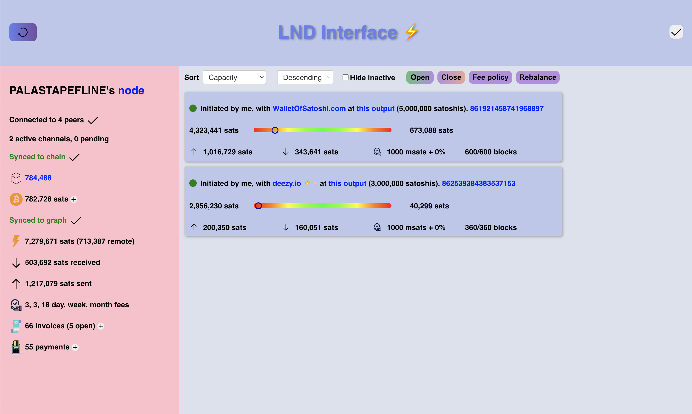

# LND Interface ⚡️
This is a lightweight server for managing your LND node. 



## Features
- View your node's information
- View your channels' information
- Open and close channels
- Manage liquidity in channels (rebalance between channels)
- Manage fee policies
- View your fees income
- Make and receive lightning payments
- View your unspent onchain funds, send and receive onchain funds

## Coming next
- Easier deployment with docker
- HTTPS protocol and certificate identification to be able to access the api from anywhere, not only locally
- Loop in and out integration
- LNURL integration

## Getting started

### Requirements
You need a running LND instance ([0.16.0-beta](https://github.com/lightningnetwork/lnd/releases/tag/v0.16.0-beta)) with Bitcoin Core as backup on a Ubuntu machine. npm version is 9.5.0 and node version is v18.15.0.

### Clone the repository

    git clone
    cd lnd-interface

### Deploy the server
    cd backend

Install PostgreSQL

    sudo apt update
    sudo apt install postgresql postgresql-contrib


Create a new user
```
psql postgres

postgres=# CREATE ROLE yourusername WITH LOGIN PASSWORD yourpassword;
postgres=# ALTER ROLE yourusername CREATEDB;
postgres=# \q
```
Create the api database
```
psql -d postgres -U yourusername

postgres=> CREATE DATABASE api;
```

Update the ```.env-sample``` accordingly, and rename the file to ```.env```:
```
USER=yourusername
PASSWORD=yourpassword
DATABASE=api
HOST=localhost
PORT=5432
```

### Run the server

```
npm i
npm start
````

The server is now listening at port 3001. ```curl http://localhost:3001``` should return a json indicating if the db updated successfully:

```
{
    "getinfo":{"date":"2023-04-08 11:00:01.637028+00","success":true},
    "channels":{"date":"2023-04-08T11:00:01.542Z","success":true},
    "feereport":{"date":"2023-04-08T11:00:01.714Z","success":true},
    "onchain_balance":{"date":"2023-04-08T11:00:01.817Z","success":true},
    "invoices":{"date":"2023-04-08 11:00:01.935417+00","success":true},
    "payments":{"date":"2023-04-08 11:00:02.122564+00","success":true},
    "unspent":{"date":"2023-04-08 11:00:02.192671+00","success":true}
}
````
**Do not open the server port on the internet, since anyone who can access it is able to control your node. Use a firewall like [ufw](https://help.ubuntu.com/community/UFW) to deny all connections to port 3001.**

### Deploy the frontend
```
cd ../frontend
npm i
npm run build
cd build
python3 -m http.server 3000
```

You should now be able to access the frontend at http://localhost:3000